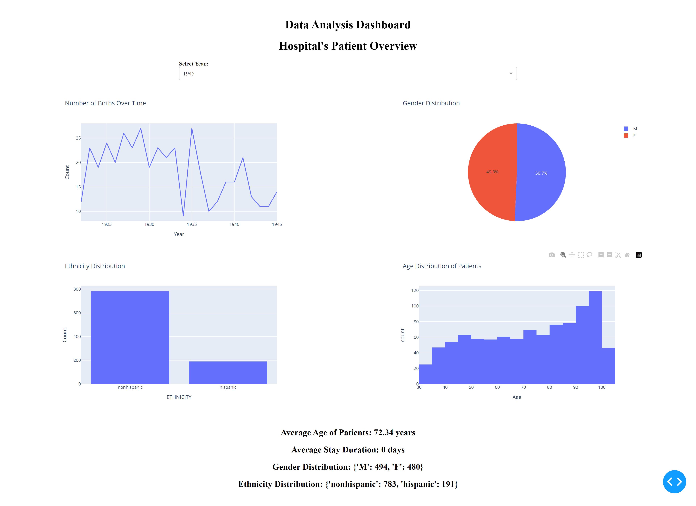

# Data Analysis Dashboard

## Overview

This project is a data analysis dashboard built using Python, Dash, Pandas, and Plotly. The dashboard visualizes patient data and provides insights through various charts and metrics.

## Features

- Line chart showing the number of births over time.
- Pie chart displaying gender distribution.
- Bar chart showing ethnicity distribution.
- Histogram illustrating the age distribution of patients.
- Dropdown to filter data by year.

## Setup

1. **Clone the Repository**

   ```bash
   git clone https://github.com/EshaanManchanda/Data-Analysis-Dashboard.git

2. **Install Required Libraries**

```bash

pip install pandas dash plotly
or
pip install -r requirements.txt
```
3. **Run the Application**

```bash
python app.py
```

4. **View the Dashboard**

Open your web browser and navigate to http://127.0.0.1:8050/ to view the dashboard.

5. **Files**

1. app.py: Main application file.
2. data_preparation.py: Script to load and process data.
3. patients.csv: Sample dataset containing patient information.
4. Future Improvements
5. Add data for hospital stays and costs.
6. Implement additional interactive features.
7. Improve styling and user experience.


6. **Screenshots**

**Home Page**

